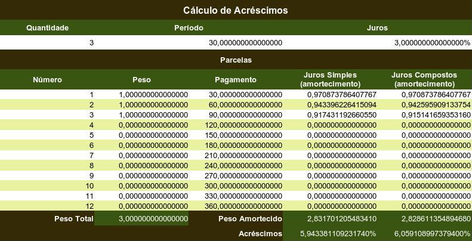

# Planilha

PORTUGUÊS
=========

A planilha [juros.xlsx](juros.xlsx) (Cálculo de Acréscimos) implementa o algoritmo `jurosParaAcrescimo` utilizado neste projeto. Seu objetivo é servir como referência para validação das implementações nos diversos dialetos de programação e também como ferramenta para experimentação com diferentes períodos, pagamentos, pesos e taxas de juros. Usando a ferramenta `Goal Seek` (`Atingir Meta`) também é possível obter o resultado do algoritmo `acrescimoParaJuros`. A planilha está limitada a até 12 `Parcelas`, embora com alterações possa ser escalada mantendo a mesma lógica.

O cálculo dos acréscimos a partir dos juros (`jurosParaAcrescimo`) é direto. Os valores das células `Quantidade`, `Período` e `Juros` podem ser alterados livremente como nos casos de teste incluídos nas soluções. Na tabela de `Parcelas`, os valores da coluna `Peso` serão preenchidos com os valores 1.0 ou 0.0, de acordo com a célula `Quantidade`. Pode-se ver como isso funciona na imagem acima. Quando a `Quantidade` é 3, apenas os três primeiros pesos são 1.0, os restantes ficam com o valor 0.0, o que, efetivamente, os exclui dos cálculos. Os valores da coluna `Pagamento` serão preenchidos com o valor na célula `Período`, multiplicado pelos valores na coluna `Número`. As colunas `Número`, `Peso` e `Pagamento` podem ser editadas diretamente nas células, sobrescrevendo valores e fórmulas padrão.

O cálculo dos juros a partir do acréscimo (`acrescimoParaJuros`) deve ser feito usando a ferramenta `Goal Seek` (`Atingir Meta`). A `Célula de fórmula` deve ser ou a célula de `Acréscimo` dos `Juros Simples` (célula $D$19) ou a célula de `Acréscimo` dos `Juros Compostos` ($E$19). No `Valor de destino`, coloque o valor do `Acréscimo` pretendido, mas em percentual (inclua `%`, como em `10%`). Em `Célula variável` coloque a célula `Juros` ($D$3).

ENGLISH
=======

The spreadsheet [juros.xlsx](juros.xlsx) (Increase Calculation) implements the `jurosParaAcrescimo` algorithm used in this project. Its purpose is to serve as a reference for validating implementations in various programming dialects and also as a tool for experimentation with different periods, payments, weights, and interest rates. Using the `Goal Seek` tool, it is also possible to obtain the result of the `acrescimoParaJuros` algorithm. The spreadsheet is limited to up to 12 `Installments`, although with modifications this limit can be extended while maintaining the same logic.

The calculation of increase from interest (`jurosParaAcrescimo`) is straightforward. The values ​​of the `Quantity`, `Period`, and `Interest` cells can be freely changed, as in the test cases included in the solutions. In the `Installments` table, the values ​​in the `Weight` column will be filled with the values ​​1.0 or 0.0, according to the `Quantity` cell. You can see how this works in the image above. When the `Quantity` is 3, only the first three weights are 1.0; the remaining ones are 0.0, effectively excluding them from the calculations. The values ​​in the `Payment` column will be filled with the value in the `Period` cell, multiplied by the values ​​in the `Number` column. The `Number`, `Weight`, and `Payment` columns can be edited directly in the cells, overriding default values ​​and formulas.

The calculation of interest from the increase (`acrescimoParaJuros`) should be done using the `Goal Seek` tool. The `Formula cell` must be either the `Increase` cell for `Simple Interest` (cell $D$19) or the `Increase` cell for `Compound Interest` ($E$19). In the `Target value`, enter the desired `Increase` value, but as a percentage (include `%`, as in `10%`). In `Variable cell`, enter the `Interest` cell ($D$3).
