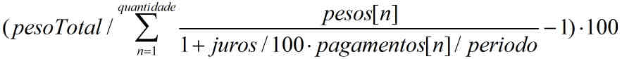
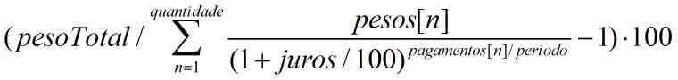

# Resolução de Equação Transcendente

Existem equações que não podem ser resolvidas com métodos elementares. São as chamadas [equações transcendentes](https://pt.wikipedia.org/wiki/Equa%C3%A7%C3%A3o_transcendente). Você precisa aplicar um conceito de **Cálculo Numérico** chamado **Método da Bisseção** para resolvê-las. Esse método é utilizado para procurar os zeros das funções. Aqui, iremos resolver uma dessas equações, que é o cálculo do percentual de juros a partir do percentual de acréscimo de um conjunto de parcelas ponderadas.

Nosso projeto será em **Python**, por simplicidade, mas as outras soluções neste repositório seguem as mesmas estrutura e lógica. Começamos colocando, em `Juros.py`, alguns valores básicos, que mudam pouco, e que iremos guardar como atributos em nossa classe `Juros`:

```python
class Juros:
    """Classe que faz o cálculo do juros, sendo que precisa de arrays pra isso"""
    Quantidade = 0
    Composto = False
    Periodo = 30.0
    Pagamentos = []
    Pesos = []
```

Temos **três** atributos simples, a **quantidade** total de pagamentos (`Quantidade`), se os juros são **compostos** (`Composto`), e a quantidade de **períodos** sobre os quais os juros incidem (por exemplo, a cada `30.0` **dias**; veja que o **período** não precisa ser em **dias**, pode ser em **semanas**, **meses** ou mesmo **anos**, somente se exige que os **prazos de pagamentos** utilizem a mesma **unidade de tempo**) (`Periodo`). E **dois** atributos *arrays*: a quantidade de períodos de **prazo** de cada **pagamento** (por exemplo, `0.0`, `30.0`, `60.0` e `90.0` **dias**) (`Pagamentos`), e os **pesos** de cada **pagamento** (por exemplo, se a **parcela a vista** fosse o **dobro** das demais, ficaria `2.0`, `1.0`, `1.0`, `1.0`) (`Pesos`).

Nosso construtor irá permitir a definição dos **três** atributos simples:

```python
    def __init__(self, quantidade=0, composto=False, periodo=30.0):
        """O construtor inicializa os atributos escalares"""
        self.Quantidade = quantidade
        self.Composto = composto
        self.Periodo = periodo
```

O *array* `Pagamentos` terá um método para incluir elementos a partir de uma *string*:

```python
    def setpagamentos(self, delimitador=",", pagamentos=""):
        """Define as datas de pagamento a partir de uma string separada pelo delimitador"""
        self.Pagamentos.clear()
        if pagamentos == "":
            for i in range(self.Quantidade):
                self.Pagamentos.append((i + 1) * self.Periodo)
        else:
            temporaria = pagamentos.split(delimitador)
            for i in range(self.Quantidade):
                self.Pagamentos.append(float(temporaria[i]))
```

Ele recebe um delimitador e uma *string* de números separados pelo delimitador (Exemplo: `“,”`, `“0,30,60,90”`). Por padrão, se a *string* for vazia, os valores no *array* serão incluídos com os valores de `Periodo` vezes o número da parcela (considerando a primeira como `1`). Por exemplo, com `Periodo` = `30.0`, para `30.0`, `60.0`, `90.00`...  até a `Quantidade` de parcelas.

O *array* `Pesos` terá um método parecido:

```python
    def setpesos(self, delimitador=",", pesos=""):
        """Define os pesos a partir de uma string separada pelo delimitador"""
        self.Pesos.clear()
        if pesos == "":
            for i in range(self.Quantidade):
                self.Pesos.append(1.0)
        else:
            temporaria = pesos.split(delimitador)
            for i in range(self.Quantidade):
                self.Pesos.append(float(temporaria[i]))
```

A diferença nesse método é que, se a *string* for vazia, todos os pesos serão incluídos com o valor para `1.0`, significando que todas as **parcelas** têm o mesmo valor.

Vejamos como são feitos os cálculos.

**Juros simples**:



**Juros copostos**:



Um método que precisamos definir antes de nossos cálculos é a soma dos pesos das parcelas (`getpesototal`):

```python
    def getpesototal(self):
        """Retorna a soma total de todos os pesos"""
        acumulador = 0.0
        for i in range(self.Quantidade):
            acumulador += self.Pesos[i]
        return acumulador
```

O **Método da Bisseção** precisa ter uma função para chamar. Na nossa solução, ela calcula os juros a partir do acréscimo e dos atributos do objeto. A função é `jurosparacrescimo`:

```python
    def jurosparaacrescimo(self, juros=0.0):
        """Calcula o acréscimo a partir dos juros"""
        pesototal = self.getpesototal()

        if juros <= 0.0 or self.Quantidade < 1 or self.Periodo <= 0.0 or pesototal <= 0.0:
            return 0.0

        acumulador = 0.0

        for i in range(self.Quantidade):
            if self.Composto:
                try:
                    acumulador += self.Pesos[i] / ((1.0 + juros / 100.0) ** (self.Pagamentos[i] / self.Periodo))
                except OverflowError:
                    pass
            else:
                acumulador += self.Pesos[i] / (1.0 + juros / 100.0 * self.Pagamentos[i] / self.Periodo)

        if acumulador <= 0.0:
            return 0.0

        return (pesototal / acumulador - 1.0) * 100.0
```

Esse método recebe o percentual de **juros**.

Calculamos o peso total, guardando em `pesototal`. A variável será usada para produzir o resultado final.

Avaliamos se ao menos um valor entre `juros`, `Quantidade`, `Periodo` ou `pesototal` é **zero** ou **negativo**, o que faz o método retornar **zero**. Essa avaliação elimina boa parte do uso errado do método. Na prática, apenas em casos como `juros` **simples** igual a `1.0`, e um elemento em `Pagamentos` for **cem negativo** vezes `Periodo`, causará uma **divisão por zero**. Mas os *arrays* não estão sendo avaliados nessa **versão**, por fins **didáticos**.

Inicializamos o `acumulador` que somará o peso ponderado das parcelas (que é a contribuição que cada parcela tem em pagar o valor total, deduzindo-se os juros).

**Iteramos** a **quantidade** de parcelas. **Incrementamos** `acumulador`, para termos a **somatória** dos **pesos ponderados das parcelas**, usando o cálculo dos **juros compostos** ou o cálculo dos **juros simples**, de acordo com `Composto`.

Retornamos zero se `acumulador` for **zero** ou **negativo** (porque poderia gerar uma divisão por zero ou resultados absurdos.

O valor do acréscimo é calculado dividindo `pesototal` pelo peso ponderado pelos juros `acumulador`, diminuindo `1.0` e multiplicando por `100.0`. Por exemplo, se o valor da divisão for `1.03`, o resultado será `3%`.

Podemos escrever, agora, o método que é o objetivo desse repositório, `acrescimoparajuros`:

```python
    def acrescimoparajuros(self, acrescimo=0.0, precisao=15, maximointeracoes=65, maximojuros=50.0):
        """Calcula os juros a partir do acréscimo"""
        pesototal = self.getpesototal()

        if ( maximointeracoes < 1 or self.Quantidade < 1 or precisao < 1 or self.Periodo <= 0.0
             or acrescimo <= 0.0 or pesototal <= 0.0 or maximojuros <= 0.0 ):
            return 0.0

        minimojuros = 0.0
        mediojuros = maximojuros / 2.0

        minimadiferenca = 0.1 ** precisao

        for i in range(maximointeracoes):
            if (maximojuros - minimojuros) < minimadiferenca:
                return mediojuros
            if self.jurosparaacrescimo(mediojuros) <= acrescimo:  # bisseção
                minimojuros = mediojuros
            else:
                maximojuros = mediojuros
            mediojuros = (minimojuros + maximojuros) / 2.0

        return mediojuros
```

Os parâmetros desse método já são um pouco mais complicados. Recebemos o `acrescimo`, podemos escolher quantas casas depois da vírgula queremos de `precisao`, o máximo de iterações que o método irá aplicar, `maximoiteracoes`, e o máximo de juros que o método irá usar no começo, `maximojuros` . Apenas `acrescimo` é absolutamente necessário, pois os valores padrão dos outros parâmetros já bastam para fazer o cálculo, na maioria das situações.

Primeiro, calculamos o `pesototal`. Aqui ela não é usada para cálculos, apenas para validação.

Então testamos se alguns valores estão são iguais a **zero** ou **negativos** (`maximoiteracoes`, `Quantidade`, `precisao`, `Periodo`, `acrescimo`, `pesototal` e `maximojuros`), se sim, retornamos **zero**.

Nós iniciamos o minimo de juros como **zero**, `minimojuros` e média de juros como metade de `maximojuros`, `mediojuros`.

Em `minimadiferenca`, guardamos o valor da precisão que queremos, em `precisao` de casas decimais, para podermos avaliar quando o algoritmo pode parar (por exemplo, `0.0001` quando definimos `precisao` como `4`).

No **laço**, pŕimeiro verificamos se os valores atuais em `maximojuros` e `minimojuros` diferem menos do que `minimadiferenca`, quando nós retornamos a **média** que se encontra em `mediojuros`, pois já encontramos o resultado com a precisão que queremos.

A **mágica** do **algoritmo** que estamos implementando estão no próximo `if`. Nós chamamos o método `jurosparaacrescimo` para calcularmos se, com o valor de `mediojuros` atual, o resultado do método fica maior ou **menor** do que o parâmetro `acrescimo`. Se for **menor** ou **igual**, nós alteramos `minimojuros` para `mediojuros`. Se for **maior**, nós alteramos `maximojuros` para `mediojuros`.

A coisa mais importante, no **algoritmo**, é que ele tem esses **dois** valores, `minimojuros` e `maximojuros` que, a cada iteração, têm a sua **diferença** cortada pela **metade**. Eventualmente, a **diferença** pode ficar menor do que a **precisão** que queremos. Veja que `minimojuros` será sempre **menor** ou **igual** e `maximojuros` será sempre **maior** ou **igual** ao valor que estamos procurando.

A última coisa feita no **laço** é atualizar `mediojuros` para ser a **média** entre `minimojuros` e `maximojuros`.

Se o número de **iterações** alcançar `maximoiteracoes`, o valor de `mediojuros` será retornado, mesmo que não se alcance a **precisão** que calculamos em `minimadiferenca`. Isso é muito importante quando, por exemplo, por uma questão de **implementação** dos **números de ponto flutuante**, não for possível encontrar uma diferença entre `minimojuros` e `maximojuros` **menor** do que `minimadiferenca`.

Para mais detalhes, pesquise por **Método da Bisseção**.

Para testar a nossa **classe**, criamos um `main.py`:

```python
import Juros

# cria um objeto juros da classe juros, inicializa escalares e seta arrays
juros = Juros.Juros(3, True, 30.0)
juros.setpagamentos()
juros.setpesos()

# calcula e guarda os resultados dos métodos
pesototal = juros.getpesototal()
acrescimocalculado = juros.jurosparaacrescimo(3.0)
juroscalculado = juros.acrescimoparajuros(acrescimocalculado)

# imprime os resultados
print("Peso total = " + str(pesototal))
print("Acréscimo = " + str(acrescimocalculado))
print("Juros = " + str(juroscalculado))
```

Nós importamos `Juros`. Criamos um objeto com `3` parcelas, juros **compostos** e com períodos de `30.0` dias. Chamamos `juros.setpagamentos` e `juros.setpesos` sem parâmetros, para que `juros.pagamentos` seja igual a [`30.0`, `60.0`, `90.0`] e `juros.pesos` seja igual a [`1.0`, `1.0`, `1.0`].

Calculamos o **peso total**. Calculamos o **acréscimo** a partir de `3%` de **juros**. E fazemos o cálculo inverso, usando `acrescimocalculadl` no parâmetro `acrescimo`, sem alterar os valores padrão de `juros.acrescimoparajuros` (`15` para `precisao`, `65` para `maximoiteracoes` e `50.0` para `maximojuros`).

Depois imprimimos os três resultados.

O resultado deve ser algo parecido com isso:

```console
Peso total = 3.0
Acréscimo = 6.059108997379403
Juros = 3.0000000000000133
```
