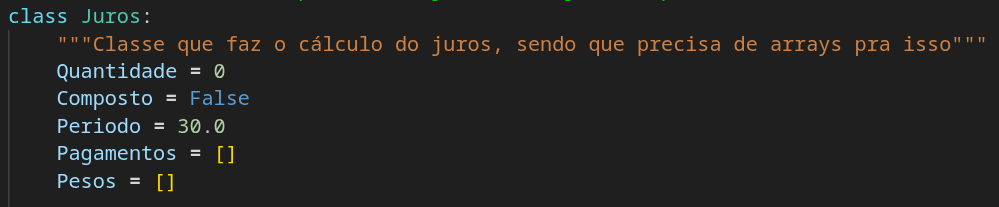
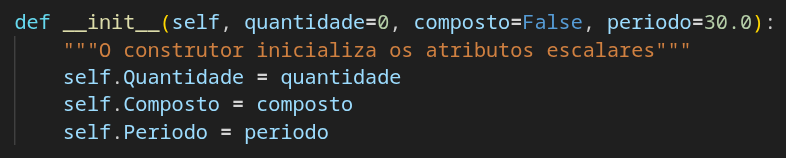
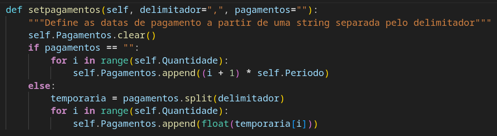
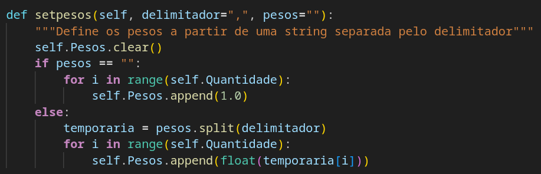
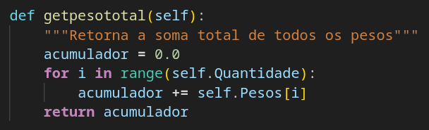
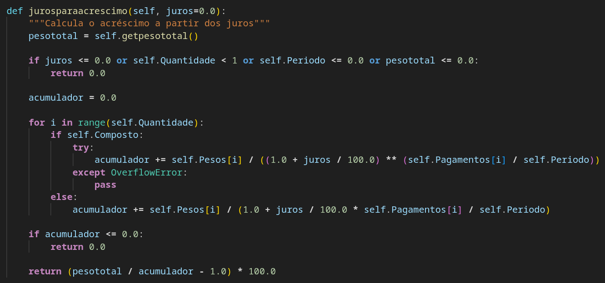
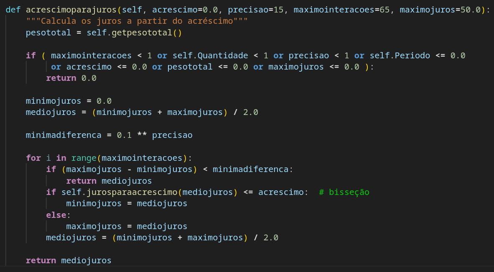
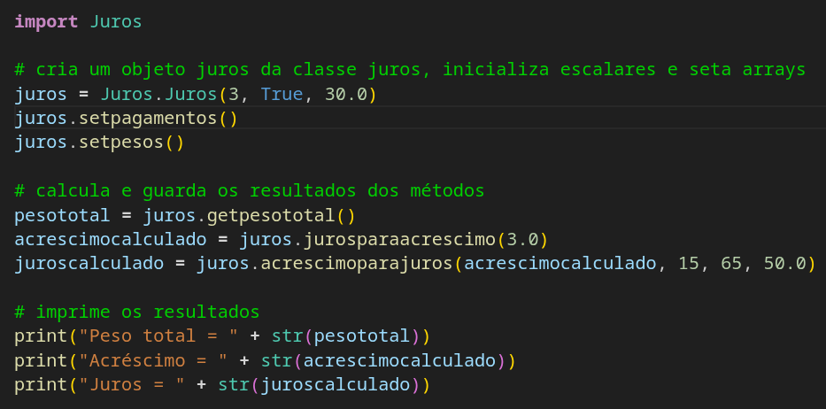

# Resolução de Equação Transcendente

Existem equações que não podem ser resolvidas com métodos elementares. São as chamadas [equações transcendentes](https://pt.wikipedia.org/wiki/Equa%C3%A7%C3%A3o_transcendente). Você precisa aplicar um conceito de `Cálculo Numérico` chamado `Método da Bisseção` para resolvê-las. Esse método é utilizado para procurar os zeros das funções. Aqui, iremos resolver uma dessas equações, que é o cálculo do percentual de juros a partir do percentual de acréscimo de um conjunto de parcelas ponderadas.

Nosso projeto será em `Python`, por simplicidade, mas as outras soluções neste repositório seguem as mesmas estrutura e lógica. Começamos colocando, em `Juros.py`, alguns valores básicos, que mudam pouco, e que iremos guardar como atributos em nossa classe `Juros`:

Temos três atributos simples, a quantidade total de pagamentos (`Quantidade`), se os juros são compostos (`Composto`), e a quantidade de dias sobre os quais os juros incidem (por exemplo, a cada 30 dias) (`Periodo`). E dois atributos arrays: a quantidade de dias de prazo de cada pagamento (por exemplo, 0, 30, 60 e 90 dias) (`Pagamentos`), e os pesos de cada pagamento (por exemplo, se a parcela a vista fosse o dobro das demais, ficaria 2, 1, 1, 1) (`Pesos`).

Nosso construtor irá permitir a definição dos três atributos simples:

O array `Pagamentos` terá um método para incluir elementos a partir de uma *string*:

Ele recebe um delimitador e uma *string* de números separados pelo delimitador (Exemplo: “,”, “0,30,60,90”). Por padrão, se a *string* for vazia, os valores no array serão incluídos com os valores de `Periodo` vezes o número da parcela (considerando a primeira como 1). Por exemplo, com `Periodo` = 30.0, para 30.0, 60.0, 90.00...  até a `Quantidade` de parcelas.

O array `Pesos` terá um método parecido:

A diferença nesse método é que, se a *string* for vazia, todos os pesos serão incluídos com o valor para 1.0, significando que todas as parcelas têm o mesmo valor.

Vejamos como são feitos os cálculos.

Juros simples:

Juros copostos:

Um método que precisamos definir antes de nossos cálculos é a soma dos pesos das parcelas (`pesoTotal`'):

O **Método da Bisseção** precisa ter uma função para chamar. Na nossa solução, ela calcula os juros a partir do acréscimo e dos atributos do objeto. A função é `jurosparacrescimo`:

Esse método recebe o percentual de juros.

Calculamos o peso total, guardando em `pesototal`. A variável será usada para produzir o resultado final.

Avaliamos se ao menos um valor entre `juros`, `Quantidade`, `Periodo` ou `pesototal` é zero ou negativo, o que faz o método retornar **zero**. Essa avaliação elimina boa parte do uso errado do método. Na prática, apenas se um elemento em `Pagamentos` for em negativo vezes `Periodo` causará uma divisão por zero. Mas os arrays não estão sendo avaliados nessa versão, por fins didáticos.

Inicializamos o `acumulador` que somará o peso ponderado das parcelas (que é a contribuição que cada parcela tem em pagar o valor total, deduzindo-se os juros).

Iteramos a quantidade de parcelas. Incrementamos `acumulador`, o peso ponderado das parcelas, usando o cálculo dos **juros compostos** ou o cálculo dos **juros simples**, de acordo com `Composto` .

Retornamos zero se `acumulador` for zero ou negativo (porque poderia gerar uma divisão por zero ou resultados absurdos.

O valor do acréscimo é calculado dividindo `pesototal` pelo peso ponderado pelos juros `acumulador`, diminuindo um e multiplicando por cem. Por exemplo, se o valor da divisão for 1,03, o resultado será 3%.

Podemos escrever, agora, o método que é o nosso objetivo:

