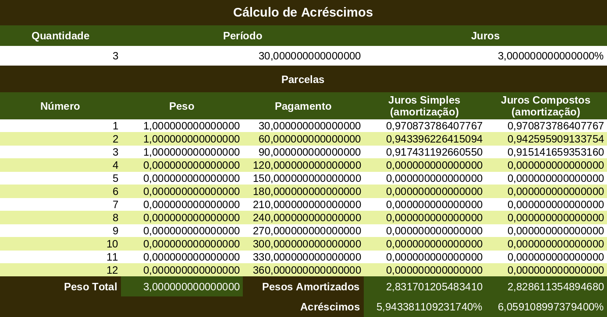

# SPREADSHEET

 

 

The spreadsheet [juros.xlsx](juros.xlsx) (Increase Calculation) implements the `jurosParaAcrescimo` algorithm used in this project. Its purpose is to serve as a reference for validating implementations in various programming dialects and also as a tool for experimentation with different periods, payments, weights, and interest rates. Using the `Goal Seek` tool, it is also possible to obtain the result of the `acrescimoParaJuros` algorithm. The spreadsheet is limited to up to 12 `Installments`, although with modifications this limit can be extended while maintaining the same logic.

The calculation of increase from interest (`jurosParaAcrescimo`) is straightforward. The values ​​of the `Quantity`, `Period`, and `Interest` cells can be freely changed, as in the test cases included in the solutions. In the `Installments` table, the values ​​in the `Weight` column will be filled with the values ​​1.0 or 0.0, according to the `Quantity` cell. You can see how this works in the image above. When the `Quantity` is 3, only the first three weights are 1.0; the remaining ones are 0.0, effectively excluding them from the calculations. The values ​​in the `Payment` column will be filled with the value in the `Period` cell, multiplied by the values ​​in the `Number` column. The `Number`, `Weight`, and `Payment` columns can be edited directly in the cells, overriding default values ​​and formulas.

The calculation of interest from the increase (`acrescimoParaJuros`) should be done using the `Goal Seek` tool. The `Formula cell` must be either the `Increase` cell for `Simple Interest` (cell $D$19) or the `Increase` cell for `Compound Interest` ($E$19). In the `Target value`, enter the desired `Increase` value, but as a percentage (include `%`, as in `10%`). In `Variable cell`, enter the `Interest` cell ($D$3).
