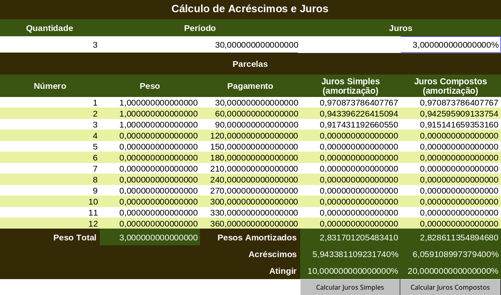

# SPREADSHEET

 

 

The spreadsheet [juros.ods](juros.ods) (**Cálculo de Acréscimos e Juros** / **Increase and Interest Calculation**) implements the `jurosParaAcrescimo` algorithm used in this project. Its purpose is to serve as a reference for validating implementations in various programming dialects and also as a tool for experimentation with different **periods**, **payments**, **weights**, and **interest rates**. The spreadsheet is limited to up to `12` `Installments`, although with modifications this limit can be extended while maintaining the same logic.

The `Peso Total` (Total Weight) is simply the sum of the values ​​in the `Peso` (Weight) column.

The calculation of increase from interest (`jurosParaAcrescimo`) is straightforward. The values ​​of the `Quantidade` (Quantity), `Período` (Period), and `Juros` (Interest Rate) cells can be freely changed, as in the test cases included in the solutions. In the `Parcelas` (Installments) table, the values ​​in the `Pesos` (Weight) column will be filled with the values ​​`1.0` or ` 0.0`, according to the `Quantidade` (Quantity) cell. You can see how this works in the image above. When the `Quantidade` (Quantity) is `3`, only the first three weights are `1.0`; the remaining ones are `0.0`, effectively excluding them from the calculations. The values ​​in the `Pagamento` (Payment) column will be filled with the value in the `Período` (Period) cell, multiplied by the values ​​in the `Número` (Number) column. The `Número` (Number), `Peso` (Weight), and `Pagamento` (Payment) columns can be edited directly in the cells, overriding default values ​​and formulas.

The calculation of interest from the increase (`acrescimoParaJuros`) must be done using the `Atingir` (Achieve) line. Enter the desired value in `Juros Simples` (Simple Interest) or `Juros Compostos` (Compound Interest), and click the corresponding button below the value.
